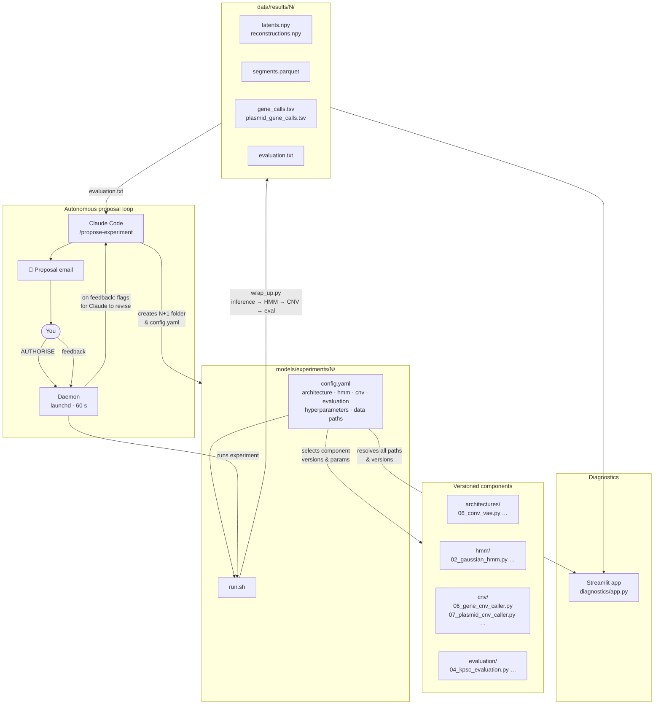

# CNVRock — AMR gene copy-number variation in *Klebsiella pneumoniae* using variational autoencoders

Antimicrobial resistance (AMR) is one of the leading global health threats. In *Klebsiella pneumoniae* Species Complex (KpSC), resistance is driven not just by gene presence but by **how many copies** of a resistance gene a bacterium carries — amplification of chromosomal genes and variable plasmid copy number (PCN) both matter clinically.

CNVRock adapts the [autoresearch](https://github.com/karpathy/autoresearch) strategy — where an AI agent continuously proposes and runs ML experiments overnight — to detect AMR-related copy-number variation in KpSC whole-genome sequencing data. A convolutional VAE learns a low-dimensional representation of genome-wide read depth; a Gaussian HMM segments the latent trajectories into copy-number states; a gene caller converts those states into per-gene calls. Claude proposes the next experiment, emails a summary, and a background daemon runs it after authorisation.

**Current results (exp 27, Phase C):**

| Gene | Type | MCC | FNR | PPV | Notes |
|------|------|-----|-----|-----|-------|
| blaSHV | chrom amp | — | — | — | chromosomal calling in progress |
| ramR | chrom del | — | — | — | chromosomal calling in progress |
| blaKPC-2 | plasmid | 1.00 | 0.00 | 1.00 | |
| blaNDM-1 | plasmid | 0.99 | 0.00 | 0.99 | |
| blaCTX-M-15 | plasmid | 0.82 | 0.20 | 1.00 | 53 FNs; reads cross-map to blaSHV |
| qnrB1 | plasmid | — | — | — | called (174 samples); GT eval pending |
| aac6-Ib-cr | plasmid | — | — | — | called (83 samples); GT eval pending |
| blaOXA-48 | plasmid | — | — | — | called (77 samples); GT eval pending |
| blaCTX-M-14 | plasmid | — | — | — | 0 calls; reads cross-map to CTX-M-15 |
| blaTEM-1 | plasmid | — | — | — | 0 calls; reads cross-map to chr blaSHV |

## Layout

```
data/
  inputs/       read-count NPY stores (chromosomal + plasmid)
  results/      per-experiment outputs (one folder per experiment)
  setup/        scripts to prepare reference, extract counts, build stores

assets/         sample manifests, BAM accession lists, reference files,
                AMRFinder+ and Kleborate ground-truth TSVs,
                plasmid reference FASTAs and gene coordinate TSV

hpc/            SLURM scripts for LSHTM HPC
  build_extended_reference.sh   BWA-index the extended reference
  remap_unmapped_to_plasmids.sh remap unmapped reads to plasmid contigs

models/
  train.py          entry point — runs a full experiment from a config
  architectures/    versioned VAE definitions  (06_conv_vae.py, …)
  hmm/              versioned HMM segmenters   (02_gaussian_hmm.py, …)
  cnv/              versioned CNV callers       (06_gene_cnv_caller.py,
                                                 07_plasmid_cnv_caller.py, …)
  evaluation/       versioned evaluators        (04_kpsc_evaluation.py, …)
  training/         dataset loader, trainer, inference (non-versioned)
  experiments/      one self-contained folder per experiment

diagnostics/    Streamlit app for interactive sample inspection
```

## Running an experiment

```bash
cd models/experiments/27
bash run.sh
```

Or directly:
```bash
.venv/bin/python models/train.py models/experiments/27/config.yaml
```

## Adding a new experiment

```bash
cp -r models/experiments/26 models/experiments/27
# edit models/experiments/27/config.yaml
```

A new experiment can reuse any existing versioned component — just point `architecture`, `hmm`, `cnv`, and `evaluation` in `config.yaml` at the same numbered files and adjust parameters. Only create a new versioned file (e.g. `08_plasmid_cnv_caller.py`) when the algorithm itself changes, not just the parameters.

Outputs are written to the `out_dir` defined in the config: `checkpoint.pth`, `latents.npy`, `reconstructions.npy`, `sample_ids.npy`, `segments.parquet`, `gene_calls.tsv`, `plasmid_gene_calls.tsv`, `evaluation.txt`.

## How it works



## Experiment proposal workflow

Claude analyses the latest `evaluation.txt`, proposes the next experiment, creates the folder, and emails a summary. Reply "AUTHORISE" to run it on the Mac mini; reply with feedback to get a revised proposal.

**First-time setup** (install the background polling daemon):
```bash
bash tools/install_daemon.sh
```

**To propose the next experiment** (invoke from Claude Code):
```
/propose-experiment
```
Claude sets up the experiment folder, writes a README, and emails a ≤100-line summary.

**The daemon** (`tools/check_and_run.sh`, running via launchd every 60 s) checks for a reply:
- `AUTHORISE` → runs the experiment automatically
- Anything else → flags that feedback is waiting; open Claude Code and run `/check-reply`

**Privacy:** `check_reply.py` searches only by the exact Message-ID of the proposal email. It never lists or reads any other email. Reply body content is never written to disk or logs.

## Diagnostics

```bash
cd diagnostics
streamlit run app.py
```

Select an experiment from the dropdown — the app loads that experiment's config to resolve data paths, component versions, and all calling parameters automatically. Displays the VAE latent space, per-sample read-depth tracks, HMM segmentation, and gene calls side by side.

## Data and reference

- **Cohort:** KpSC samples from the [AllTheBacteria](https://www.allthebacteria.org/) catalog (quality-filtered; SRA accessions in `assets/kpsc_bam_accessions.txt`)
- **Reference:** *K. pneumoniae* HS11286, NC_016845.1 (~5.3 Mb; GCF_000240185.1)
- **Extended reference:** HS11286 + plasmid contigs carrying resistance genes (`assets/HS11286_extended.fasta`)
- **Ground truth:** AMRFinder+ on AllTheBacteria assemblies + Kleborate v3 for porin/efflux status

## Plasmid gene expansion

New plasmid genes are added without any code changes:

1. Run `data/setup/add_phase_c_genes.py` — downloads representative plasmid from NCBI, BLASTs the gene, appends contig to `HS11286_extended.fasta`, adds a row to `assets/plasmid_refs/plasmid_gene_coords.tsv`
2. `sbatch hpc/build_extended_reference.sh` — re-index BWA
3. `sbatch --array=1-N%50 hpc/remap_unmapped_to_plasmids.sh` — remap per-sample
4. `python3 data/setup/merge_plasmid_counts.py ...` — update NPY store
5. Create next experiment config; all new genes are called automatically

## Setup

See [data/setup/](data/setup/) for scripts that prepare the reference, extract read counts from BAMs, and build the NPY stores.
