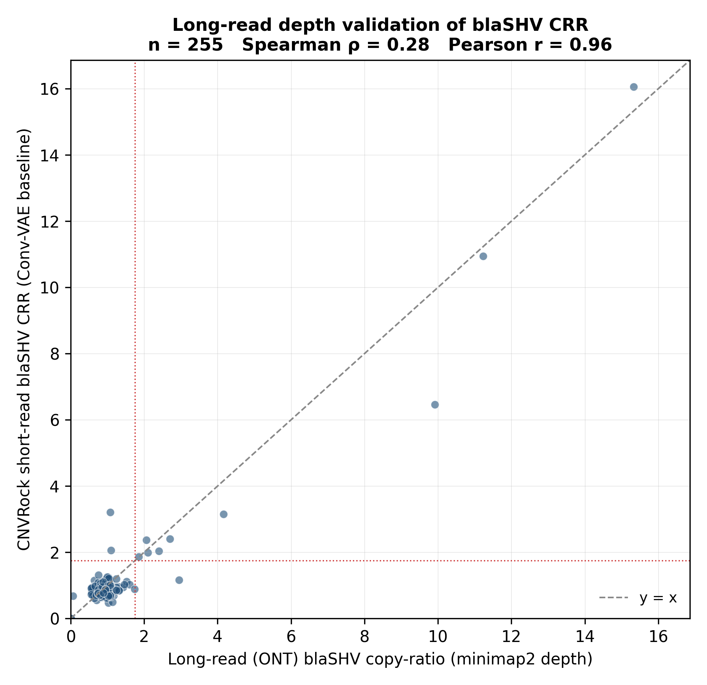
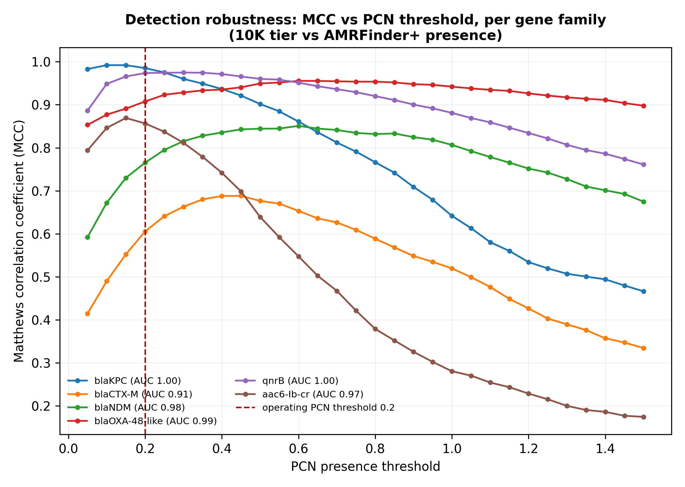
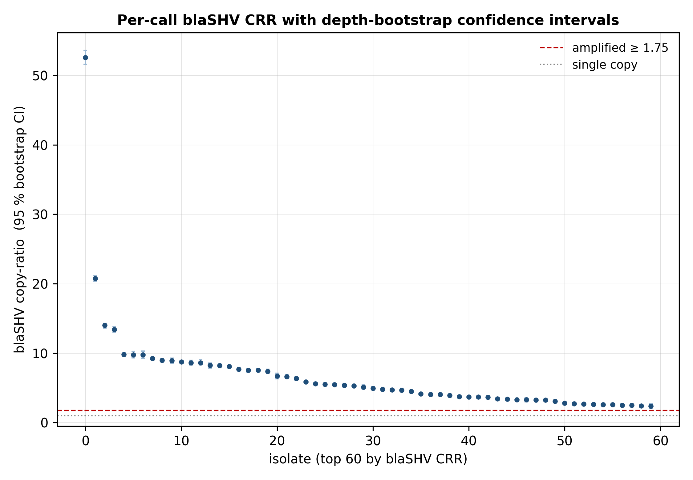
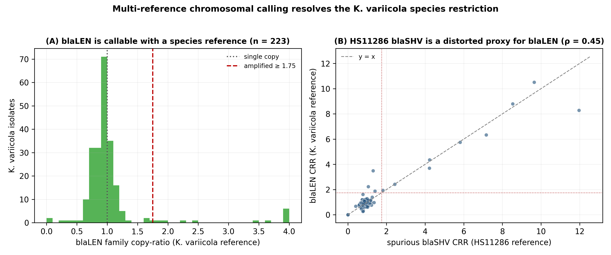
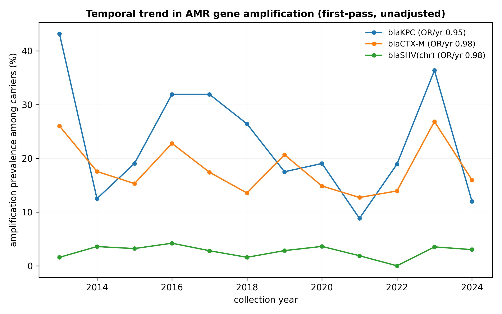

# Validation and robustness

The scaling study establishes that CNVRock **detects** AMR gene copy-number
events reliably. The analyses on this page ask a harder question: are the
copy-number **values** correct, how sensitive are the calls to the choices we
made, and do the stated limitations survive scrutiny?

All figures below are regenerated by scripts in `analysis/`; the underlying
tables live under `data/results/` (gitignored — see
[Reproducibility](10_reproducibility.md) for how to rebuild them).

## Orthogonal validation against long-read depth

The strongest test of a copy-number caller is an independent measurement of
the same locus. We identified 255 isolates in the 10 K tier with public
Oxford Nanopore data and computed the chromosomal *blaSHV* copy-ratio from
**long-read depth** — not from a long-read assembly, because assemblers
collapse tandem arrays and would erase the very signal under test.



| Quantity | Value |
|---|---|
| Isolates with paired short- and long-read data | 255 |
| Pearson *r* (short-read CRR vs long-read CRR) | **0.960** (*p* = 2 × 10⁻¹⁴²) |
| Long-read-amplified isolates (CRR ≥ 1.75) | 10 |
| Recovered by CNVRock short-read calling | **9 / 10** |

This is the result that moves CNVRock from "detects presence reliably" to
"measures dosage correctly", because the comparison uses a different
sequencing chemistry, a different read-length regime and a different
alignment path.

```{note}
The Pearson correlation is carried largely by the amplified isolates, which
span the widest copy-ratio range. Among the mostly single-copy majority the
rank correlation is much weaker, as expected when almost every isolate sits
at the same value. The operationally meaningful claim is the amplified-call
recovery (9/10), not the correlation coefficient alone.
```

Scripts: `analysis/longread_depth_validation.py`, `hpc/longread_ont_depth.sh`.

## Detection robustness to threshold choice

A detection pipeline that only works at one hand-tuned cut-off is fragile.
We swept the presence threshold across its full range for every gene family
and recorded the Matthews correlation coefficient (MCC) against AMRFinder+
presence.



| Family | *n* positive | ROC AUC | MCC at operating threshold | Best threshold |
|---|---|---|---|---|
| *blaKPC* | 865 | 1.000 | 0.985 | 0.10 |
| *qnrB* | 1 527 | 0.999 | 0.974 | 0.30 |
| *blaNDM* | 863 | 0.985 | 0.765 | 0.60 |
| *blaOXA-48*-like | 713 | 0.985 | 0.907 | 0.60 |
| *aac6-Ib-cr* | 1 729 | 0.973 | 0.857 | 0.15 |
| *blaCTX-M* | 2 724 | 0.915 | 0.606 | 0.45 |

Mean ROC AUC is **0.976** across the six families (*n* = 6 235 evaluable
samples each). The MCC curves are flat around the operating threshold, so
detection rests on genuine separability rather than a finely tuned cut-off.
*blaCTX-M* is the weakest family, for the cross-mapping reason documented in
[Evaluation](07_evaluation.md).

Script: `analysis/threshold_sensitivity.py`.

## Per-call uncertainty

Aggregate metrics say nothing about whether an *individual* amplification
call is trustworthy. We attached a confidence interval to every chromosomal
*blaSHV* copy-ratio using a parametric depth bootstrap: Poisson gene depth
over the ~2 kb locus, with the local flank resampled, 1 000 replicates.



| Quantity | Value |
|---|---|
| Calls with an interval | 6 261 |
| Amplification calls (CRR ≥ 1.75) | 94 |
| Amplification calls whose 95 % CI excludes 1.0 | **94 / 94** |
| Median CI width (all calls) | 0.115 |
| Median CI width (amplified calls) | 0.304 |

Every amplification call is statistically separated from single-copy, so
none of them is a depth-sampling artefact.

```{note}
This is a **depth-based** bootstrap, not MC-dropout over the VAE. The
distinction matters: MC-dropout would perturb the reconstruction $\hat{x}$,
whereas the quantity that carries the call is the observed gene depth.
```

Script: `analysis/percall_uncertainty.py`.

## Multi-reference chromosomal calling (*K. variicola*)

Chromosomal *blaSHV* is called only for *K. pneumoniae* and
*K. quasipneumoniae*, because *K. variicola* carries the LEN-family homolog
at the syntenic locus and its reads cross-map onto the HS11286 *blaSHV*
coordinates. We tested whether a species-appropriate reference lifts that
restriction by re-aligning the 223 10 K-tier *K. variicola* isolates to
NC_011283.1 and calling *blaLEN* from depth.



| Quantity | Value |
|---|---|
| *K. variicola* isolates re-aligned | 223 |
| *blaLEN* family copy-ratio, median | 0.94 (single-copy) |
| Amplified (CRR > 1.75) | 12 |
| Spearman ρ vs the HS11286 *blaSHV* call | 0.45 |

The species restriction is a **reference-choice limitation, not an
architectural one**: with the right reference the locus is callable and
centres on single-copy. The ρ = 0.45 also shows the HS11286 *blaSHV* value
these isolates receive is a distorted proxy rather than pure noise — which
is why they are excluded rather than reinterpreted.

Scripts: `analysis/kvariicola_multiref.py`, `hpc/kvariicola_blalen.sh`.

## Temporal trend in amplification

The per-gene λ/μ ratios are steady-state estimates, which is only reasonable
if amplification prevalence is not drifting over calendar time. We fitted a
logistic regression of the amplified indicator on collection year among
carriers (7 448 isolates with a usable year, 2013–2024).



| Gene | Carriers | Amplified | OR per year | 95 % CI | Significant? |
|---|---|---|---|---|---|
| *blaKPC* | 539 | 123 | 0.947 | 0.881–1.008 | no |
| *blaCTX-M* | 2 401 | 420 | 0.983 | 0.946–1.018 | no |
| *blaSHV* (chr) | 3 731 | 98 | 0.983 | 0.946–1.024 | no |

No gene shows a significant calendar-time trend, supporting the steady-state
assumption.

```{warning}
This is an unadjusted, first-pass trend. Which clones and which countries
were sequenced shifts across years, so a trend — or its absence — may
reflect ascertainment as much as biology. A confounder-adjusted
hierarchical model remains future work.
```

Script: `analysis/temporal_amplification.py`.

## What these analyses do not establish

- No bench validation. The candidate loci from the genome-wide scan are
  hypothesis-generating; none has been tested by qPCR or MIC assay.
- The long-read comparison covers chromosomal *blaSHV* only. Plasmid copy
  number has no comparable orthogonal measurement in this cohort.
- Latent-dimension ablation (*d* = 2/3/5, experiments 42/43/45) is
  configured but the full sweep has not been run at scale.
